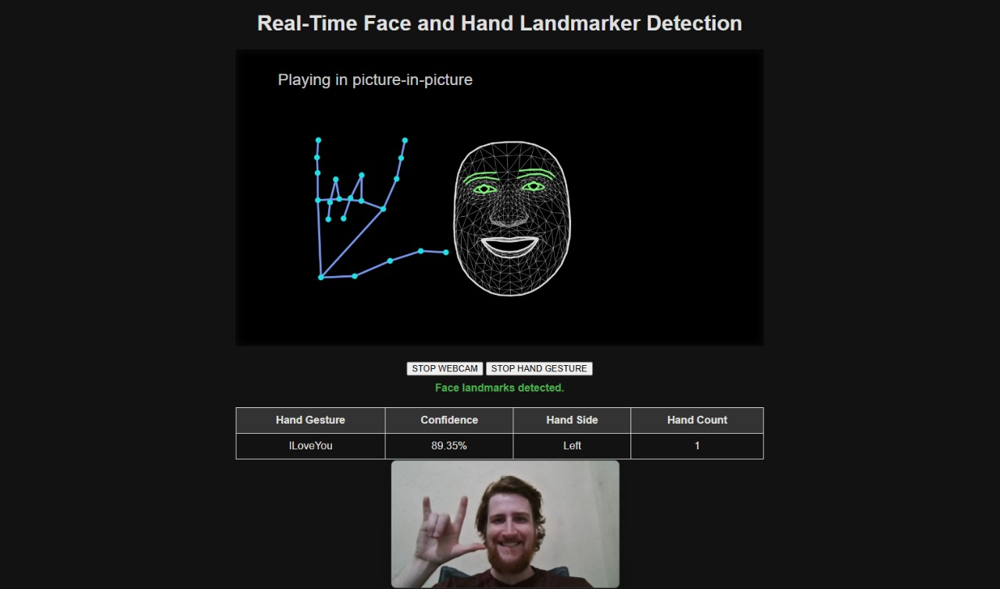

# mediapipe-node



This project integrates MediaPipe Solutions with Node.js and Express for real-time computer vision tasks. It showcases examples of image segmentation, hand and face detection, and pose detection, with a combined example for all three types of landmark detection. 

Utilizing MediaPipe's client-side JavaScript APIs, the project performs video processing directly in the browser, minimizing server-side computation. Additionally, it features logging for hand and face gestures, tracking interactions both in the console and a text file in the server logs directory.

## Project Structure

```plaintext
mediapipe-node/
├── server.js
├── package.json
├── package-lock.json
├── public/
│   ├── css/
│   │   ├── full_detection_styles.css
│   │   ├── hand_face_detection_styles.css
│   │   ├── image_segmentation_styles.css
│   │   ├── main.css
│   │   └── pose_styles.css
│   ├── images/
│   │   ├── face_landmark.png
│   │   ├── face_landmarker_keypoints.png
│   │   ├── hand-landmarks.png
│   │   ├── hand_landmark.png
│   │   ├── pose_detector.png
│   │   └── pose_landmarks_index.png
│   ├── js/
│   │   ├── full_detection.js
│   │   ├── hand_face_detection.js
│   │   ├── image_segmentation.js
│   │   └── pose_detection.js
│   └── json/
│       ├── blendshape_map.json
│       ├── hand_map.json
│       ├── gesture_map.json
│       └── pose_map.json
├── models/
│   ├── hand_landmarker.task
│   ├── face_landmarker.task
│   ├── pose_landmarker_full.task
│   └── selfie_multiclass_256x256.tflite
└── templates/
    ├── full_detection.html
    ├── hand_face_detection.html
    ├── image_segmentation.html
    ├── index.html
    └── pose_detection.html
```

## Setup Instructions

1. **Install Node.js**

   Follow the instructions on the [Node.js official website](https://nodejs.org/) to download and install Node.js. This will also install npm (Node Package Manager), which is required to manage project dependencies.

2. **Clone the Repository**

    ```sh
    git clone https://github.com/yourusername/mediapipe-node.git
    cd mediapipe-node
    ```

3. **Install Dependencies**

    Install the necessary Node.js packages:

    ```sh
    npm install express
    npm install express-validator
    ```

4. **Run the Application**

    Start the server by running:

    ```sh
    node server.js
    ```

5. **Access the Application**

    Open your browser and navigate to `http://localhost:3000` to view the homepage.

## Project License

This project is licensed under the Apache 2.0 License. See the [LICENSE](LICENSE) file for details.

## MediaPipe License

The MediaPipe models and code included in this project are licensed under the Apache License, Version 2.0. See the [LICENSE_MediaPipe](LICENSE_MediaPipe) file for details. 

## Documentation

**Express:**
- [Express Official Site](https://expressjs.com)

**MediaPipe Documentation:**

- **Hand Landmark Documentation:**
  - [Hand Landmark Documentation](https://ai.google.dev/edge/mediapipe/solutions/vision/hand_landmarker)
  - [Hand Landmark Code Example](https://codepen.io/mediapipe-preview/pen/gOKBGPN)
  - [Hands Lite/Full Model Card](https://storage.googleapis.com/mediapipe-assets/Model%20Card%20Hand%20Tracking%20(Lite_Full)%20with%20Fairness%20Oct%202021.pdf)

- **Face Landmark Documentation:**
  - [Face Landmark Documentation](https://ai.google.dev/edge/mediapipe/solutions/vision/face_landmarker)
  - [Face Landmark Code Example](https://codepen.io/mediapipe-preview/pen/OJBVQJm)
  - [Blendshape V2 Model Card (November 11, 2022)](https://storage.googleapis.com/mediapipe-assets/Model%20Card%20Blendshape%20V2.pdf)
  - [BlazeFace Short Range Model Card (June 9, 2021)](https://storage.googleapis.com/mediapipe-assets/MediaPipe%20BlazeFace%20Model%20Card%20(Short%20Range).pdf)
  - [Face Mesh V2 Model Card](https://storage.googleapis.com/mediapipe-assets/Model%20Card%20MediaPipe%20Face%20Mesh%20V2.pdf)

- **Pose Landmarker Documentation:**
  - [Pose Landmarker Documentation](https://ai.google.dev/edge/mediapipe/solutions/vision/pose_landmarker)
  - [Pose Landmarker Code Example](https://codepen.io/mediapipe-preview/pen/abRLMxN)
  - [BlazePose GHUM 3D Landmarker Model Card (April 16, 2021)](https://storage.googleapis.com/mediapipe-assets/Model%20Card%20BlazePose%20GHUM%203D.pdf)

- **Image Segmentation Documentation:**
  - [Image Segmentation Documentation](https://ai.google.dev/edge/mediapipe/solutions/vision/image_segmenter)
  - [Image Segmentation Code Example](https://codepen.io/mediapipe-preview/pen/xxJNjbN)
  - [Multiclass Segmentation Model Card (May 10, 2023)](https://storage.googleapis.com/mediapipe-assets/Model%20Card%20Multiclass%20Segmentation.pdf)

**Input Shapes:**
- FaceDetector: 192 x 192
- FaceMesh-V2: 256 x 256
- Blendshape: 1 x 146 x 2
- HandLandmarker (Full): 192 x 192, 224 x 224
- Pose detector (Full): 224 x 224 x 3
- Pose landmarker (Full): 256 x 256 x 3
- SelfieMulticlass: 256 x 256